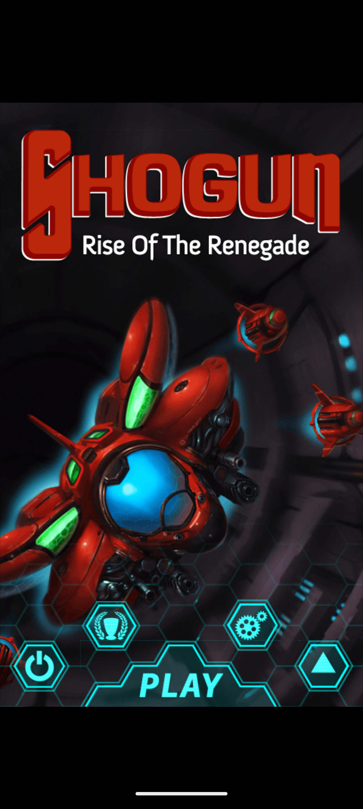

# Shogun on 64-bit Android

A port of **Shogun: Rise Of The Renegade** (int13, 2012) to devices that no
longer have a 32-bit ARM execution state.

The game shipped as a single ARMv7 native library, `libHAL.Android.so`, with
no Java game logic to recompile and no source anywhere. Modern phones —
a Pixel 10 among them — report an empty `ro.product.cpu.abilist32`, so the
original APK is refused at install time with `INSTALL_FAILED_NO_MATCHING_ABIS`
and there is nothing a repackage can do about it.

So the 2012 library is not recompiled. It is **run**: loaded into an emulated
ARM32 address space, with every call it makes out of itself — libc, OpenGL ES,
JNI — caught at the boundary and serviced by 64-bit native code, which forwards
graphics straight to the device's real GLES driver.

It boots, renders, plays its music, and takes touch input on hardware that
cannot execute a single one of its instructions.

<p align="center">
  
</p>

> **This repository contains the port, not the game.** No engine binary, asset
> pack, artwork or music is distributed here. You need your own copy of the
> APK. See [Supply the game](#2-supply-the-game).

---

## How it works

```
        Android (arm64)                    guest (ARM32, emulated)
  ┌───────────────────────────┐      ┌──────────────────────────────┐
  │ ShogunActivity            │      │                              │
  │   GLSurfaceView (GLES1)   │      │      libHAL.Android.so       │
  │   AudioTrack thread       │      │      (unmodified, 2012)      │
  │                           │      │                              │
  │ libshogun.so              │◄────►│  imports resolved to a trap  │
  │   Runtime   (ELF + CPU)   │ trap │  page; every call out lands  │
  │   shims     (99 imports)  │      │  in a 64-bit shim            │
  │   gl        (GLES1 fwd)   │      │                              │
  │   jni_bridge (fake JNIEnv)│      └──────────────────────────────┘
  └───────────┬───────────────┘
              │  real glDrawArrays, glTexImage2D, ...
              ▼
       PowerVR GLES 1.x driver
```

Four pieces do the work:

**The loader** maps the library's `PT_LOAD` segments into guest memory and
applies its relocations (`R_ARM_RELATIVE`, `ABS32`, `GLOB_DAT`, `JUMP_SLOT`) —
754 of them, none left unresolved. Every PLT slot for an imported symbol is
pointed at a **trap page** instead of at real code.

**The shims** are what those traps reach: 99 host implementations covering
libc, math, pthreads, file I/O and the GLES entry points. Arguments are read
straight out of the guest's registers and stack under AAPCS soft-float rules.

**The GL bridge** forwards fixed-function GLES 1.x to the device driver
untouched — no shader translation, no ANGLE. It converts the 16.16 fixed-point
entry points the engine prefers (`glOrthox`, `glLoadMatrixx`, `glMultMatrixx`)
and copies client vertex arrays out of guest memory at every draw, because the
engine binds its pointers once and rewrites the buffer between draws.

**The JNI bridge** builds a 233-slot `JNIEnv` function table inside guest
memory. The engine calls into it exactly as it would on a 2012 device; each
slot traps out to the real `JNIEnv` on the host side.

Two write-ups go deeper:

- **[docs/FROM-ONE-APK.md](docs/FROM-ONE-APK.md)** — how the port was actually
  arrived at, starting from nothing but the APK: what to look at, in what
  order, and which findings decided what happened next.
- **[docs/PORTING.md](docs/PORTING.md)** — the address map and the nine
  findings that cost the most to learn.
- **[docs/MODDING.md](docs/MODDING.md)** — what can be changed and how, from
  calling the engine's own 90-function gameplay API to adding a line to the
  game's own settings menu.

---

## Status

Running on a Pixel 10 Pro, Android 17 (`arm64-v8a` only, PowerVR GPU):

| | |
|---|---|
| Boot, asset pack, save data | working |
| 2D rendering (menus, HUD, bullets) | working |
| 3D rendering (hangar, level transitions) | working |
| Audio — MP3 music and SFX, 22050 Hz | working |
| Touch input | working |
| Frame cost | **5.8–12.9 ms** against a 16.7 ms budget |
| Audio callback cost | ~3 ms per 512-sample buffer |
| Emulated throughput (desktop harness) | ~1650–2000 MIPS vs the ~600 MIPS the game was written for |

Not done: gameplay past the first levels is lightly tested, and the old Google
Play Billing v1 path is stubbed out rather than reimplemented — the service it
called has not existed for over a decade, and nothing in this build was gated
behind it in the first place (see [apk-patch/README.md](apk-patch/README.md)).

---

## Building

### 1. Prerequisites

* Android SDK with build-tools 36 and platform 36 (`ANDROID_HOME`)
* A JDK 17+ (`JAVA_HOME` — Android Studio ships one under `jbr/`)
* Android NDK (`ANDROID_NDK`)
* CMake 3.22+, Python 3.9+
* `pip install Pillow` for launcher-icon generation
* For the desktop harness only: `pip install unicorn capstone keystone-engine`

### 2. Supply the game

Put your own copy of the Shogun APK in the repository root as
`Shogun-1.2.4.apk`, then:

```bash
python tools/extract_assets.py Shogun-1.2.4.apk
```

That unpacks the engine binary and the encrypted asset pack into the places the
build expects, rebuilds the launcher icon as an adaptive icon, and rewrites the
in-game "What's New" panel to credit the port. Nothing it produces is tracked by
git.

### 3. Build Unicorn for arm64-v8a

```bash
git clone https://github.com/unicorn-engine/unicorn
cd unicorn && mkdir build && cd build
cmake .. -DCMAKE_TOOLCHAIN_FILE=$ANDROID_NDK/build/cmake/android.toolchain.cmake \
         -DANDROID_ABI=arm64-v8a -DANDROID_PLATFORM=android-26 \
         -DCMAKE_BUILD_TYPE=Release -DUNICORN_ARCH=arm
cmake --build . -j
cp libunicorn.so ../../android/app/src/main/jniLibs/arm64-v8a/
```

### 4. Build the native runtime

```bash
cd android/app/src/main/cpp && mkdir -p build && cd build
cmake .. -DCMAKE_TOOLCHAIN_FILE=$ANDROID_NDK/build/cmake/android.toolchain.cmake \
         -DANDROID_ABI=arm64-v8a -DANDROID_PLATFORM=android-26 \
         -DCMAKE_BUILD_TYPE=Release \
         -DUNICORN_INC=/path/to/unicorn/include \
         -DUNICORN_LIB=/path/to/unicorn/build/libunicorn.so
cmake --build . -j
```

### 5. Package and install

```bash
./android/build-apk.sh
adb install -r android/shogun-arm64.apk
```

`build-apk.sh` runs aapt2, javac, d8, zipalign and apksigner directly — no
Gradle. On first run it generates a debug keystore beside itself; that key is
gitignored, and you need the same one to sign any later update.

---

## Repository layout

| Path | What it is |
|---|---|
| `android/app/src/main/cpp/` | The runtime: ELF loader + CPU, shims, GL bridge, JNI bridge |
| `android/app/src/main/java/` | The Android shell — Activity, GLSurfaceView, audio thread |
| `android/build-apk.sh` | Gradle-free packaging pipeline |
| `runtime/` | The desktop harness the design was proven on, in Python |
| `apk-patch/` | Repack/re-sign the *original* 32-bit APK (v1 + v2 signing, pure Python) |
| `bench/` | Trap-cost benchmark — the number that decides whether 60 fps is reachable |
| `tools/` | Asset extraction, icon generation, changelog patching |
| `device-test.py` | Everything about a connected device that adb alone can establish |
| `docs/` | How it was done, the porting findings, what can be modded, harness notes |

---

## Legal

The porting code here is MIT licensed. The game is not mine and is not
included — see [LICENSE](LICENSE) and [CREDITS.md](CREDITS.md).

This exists to keep a purchased copy of a delisted 2012 game playable on
hardware that dropped the instruction set it was built for. It ships no game
code or assets -- the one screenshot above is of the port running, included as
evidence that it does -- defeats no DRM (the shipped build has none active),
and is of no use to anyone without their own copy of the game.
